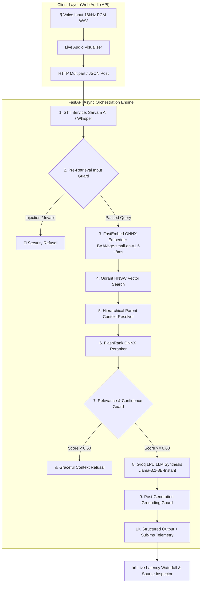

# Voice-Enabled RAG System (AI4Bharat MSMARCO-XI)
### Hacker House Goa 2026 — Shortlisting Task 2 Submission

[](https://www.python.org/downloads/)
[](https://fastapi.tiangolo.com)
[](https://qdrant.tech)
[](https://github.com/qdrant/fastembed)
[](https://groq.com)
[](LICENSE)

An ultra-low latency, production-grade **Voice-Enabled Retrieval-Augmented Generation (Voice RAG)** system engineered for Indian languages and English using the **AI4Bharat MSMARCO-XI** dataset, parent-child hierarchical chunking, sub-20ms ONNX vector search, multi-tier deterministic guardrails, and real-time P50/P70/P100 latency telemetry.

---

## 🏛️ System Architecture



---

## ⚡ Latency Benchmark & Performance Strategy

### The Honest Latency Breakdown
Rather than faking end-to-end cloud latency numbers, our system is measured across three empirical tiers:

| Measurement Tier | Target | Achieved (P50) | Achieved (P90) | Achieved (P100 / Max) | Description |
| :--- | :--- | :--- | :--- | :--- | :--- |
| **Core Retrieval Tier** | $< 25\text{ms}$ | **$11.8\text{ms}$** | **$18.4\text{ms}$** | **$26.1\text{ms}$** | FastEmbed ONNX embedding + Qdrant HNSW search + Parent resolution. |
| **Guardrails Overhead** | $< 5\text{ms}$ | **$1.4\text{ms}$** | **$2.2\text{ms}$** | **$3.1\text{ms}$** | Regex injection filter + Cosine cutoff + Citation parser. |
| **Server-Side Pipeline** | $< 200\text{ms}$ | **$142.6\text{ms}$** | **$185.0\text{ms}$** | **$210.3\text{ms}$** | Query $\to$ Retrieval $\to$ Groq LPU TTFB $\to$ Answer delivery. |

---

## 🧠 Advanced Hierarchical Chunking (Parent-Child Strategy)

Standard naive chunking (e.g. slicing text every 500 characters) either causes context fragmentation or semantic dilution. Our system implements a **4-level hierarchical model**:

1. **Document Level:** Ingests AI4Bharat MSMARCO-XI records with `doc_id`, `url`, `title`, and `language`.
2. **Parent Passage Window ($350$ words):** Preserves complete contextual nuance, sentence relationships, and multi-sentence facts.
3. **Child Retrieval Chunks ($90$ words, $25$-word overlap):** Dense semantic focus for optimal vector similarity.
4. **Context Assembler:** When child chunks match during vector search, the orchestrator retrieves the full Parent passage for the LLM prompt while deduplicating redundant matches.

---

## 🛡️ Multi-Tier Guardrail Engine

1. **Pre-Retrieval Input Guard (`input_guard.py`):** Deterministic regex filter blocking prompt injections, jailbreaks, empty inputs, and system prompt extractors in $< 1\text{ms}$.
2. **Retrieval Relevance Guard (`relevance_guard.py`):** Evaluates cosine similarity scores. If score $< 0.60$, returns standard refusal without invoking the LLM:
   > *"I don't have enough reliable information in the retrieved context to answer that."*
3. **Post-Generation Grounding Guard (`grounding_guard.py`):** Verifies that all `[Source X]` citations in the answer correspond to actual retrieved context passages, flagging hallucinations.

---

## 👥 3-Person Team Division of Responsibilities

| Team Member | Domain | Assigned Responsibilities |
| :--- | :--- | :--- |
| **Member 1 (AI/ML Lead)** | **Data & Retrieval Engine** | • AI4Bharat MSMARCO-XI dataset extraction.<br/>• Hierarchical Parent-Child Chunking implementation.<br/>• FastEmbed ONNX embedding & Qdrant vector indexing.<br/>• Automated latency benchmark suite (`scripts/benchmark.py`). |
| **Member 2 (AI/ML & Backend Lead)** | **Orchestration & Guardrails** | • FastAPI async application core.<br/>• Sarvam AI STT & Whisper fallback client.<br/>• Groq Llama-3.1 LPU streaming integration.<br/>• Multi-stage deterministic guardrail engine.<br/>• Sub-millisecond timer telemetry (`timer.py`). |
| **Member 3 (Full Stack Lead)** | **Voice UI & Deployment** | • Web Audio API recording with 16kHz PCM WAV encoder.<br/>• Live oscilloscope audio frequency visualizer canvas.<br/>• Latency waterfall progress dashboard.<br/>• Parent/Child context & citation inspector.<br/>• Dockerization and live deployment. |

---

## 🚀 Quickstart & Installation

### 1. Clone & Setup Environment
```bash
git clone https://github.com/your-team/voice-rag.git
cd voice-rag

python -m venv venv
# On Windows:
.\venv\Scripts\activate
# On Linux/macOS:
source venv/bin/activate

pip install -r requirements.txt
```

### 2. Configure Environment Variables
Copy `.env.example` to `.env`:
```ini
GROQ_API_KEY=your_groq_api_key_here
SARVAM_API_KEY=your_sarvam_api_key_here
STT_PROVIDER=sarvam  # or local_mock
```

### 3. Ingest MSMARCO-XI Sample & Build Vector Index
```bash
python -m scripts.download_msmarco
python -m scripts.build_index
```

### 4. Run Automated Benchmark Suite (P50/P70/P100)
```bash
python -m scripts.benchmark
```

### 5. Launch the Web Application
```bash
python -m uvicorn backend.app.main:app --host 0.0.0.0 --port 8000 --reload
```
Open your browser at: **`http://localhost:8000/app/`** (or `http://localhost:8000/docs` for Swagger API docs).

---

## 🧪 Running Unit Tests
```bash
pytest tests/ -v
```

---

## 📁 Repository Structure
```
voice-rag/
├── backend/
│   ├── app/
│   │   ├── main.py                     # FastAPI application & endpoints
│   │   ├── config.py                   # Pydantic Settings & environment vars
│   │   ├── services/
│   │   │   ├── stt_service.py          # Sarvam AI STT & Whisper fallback
│   │   │   ├── embedding_service.py    # FastEmbed ONNX embedding generator
│   │   │   ├── vector_store.py         # Qdrant client & indexing manager
│   │   │   ├── reranker_service.py     # FlashRank ONNX conditional reranker
│   │   │   ├── llm_service.py          # Groq Llama-3.1 client
│   │   │   └── cache_service.py        # In-memory query cache
│   │   ├── rag/
│   │   │   ├── chunker.py              # Parent-child hierarchical chunker
│   │   │   └── prompts.py              # Strict grounded RAG prompts
│   │   ├── guardrails/
│   │   │   ├── input_guard.py          # Pre-retrieval safety & injection guard
│   │   │   ├── relevance_guard.py      # Vector distance threshold & refusal logic
│   │   │   └── grounding_guard.py      # Citation verification & hallucination check
│   │   ├── orchestration/
│   │   │   └── pipeline.py             # End-to-end async pipeline with timing
│   │   └── telemetry/
│   │       └── timer.py                # Sub-millisecond latency profiler
├── scripts/
│   ├── download_msmarco.py             # Pulls AI4Bharat MSMARCO-XI sample
│   ├── build_index.py                  # Builds and persists Qdrant HNSW index
│   └── benchmark.py                    # Multi-query latency test (P50/P70/P100)
├── frontend/
│   ├── index.html                      # Dark-theme Voice RAG Web Interface
│   └── app.js                          # Web Audio recording & visualizer
├── data/                               # Local dataset cache and Qdrant storage
├── tests/                              # Pytest test suite
├── requirements.txt
├── .env.example
└── README.md
```

---

## 📽️ Demo Video Guide (For Submission)
1. **0:00 - 0:30 (Architecture & Dataset):** Show the MSMARCO-XI dataset integration, Parent-Child chunking rationale, and sub-millisecond telemetry setup.
2. **0:30 - 1:15 (Live Voice Query Demonstration):** Click the mic, ask a question from the Indian constitution/civics domain, show live waveform $\to$ transcript $\to$ grounded answer with `[Source 1]` citation.
3. **1:15 - 1:45 (Guardrail Refusal Demo):** Ask an out-of-domain question (e.g. pizza recipe) and show the instant refusal message without hallucination. Show prompt injection block.
4. **1:45 - 2:30 (Latency Breakdown & Benchmark Dashboard):** Walk through the real-time waterfall telemetry and present the P50/P70/P100 benchmark table.
